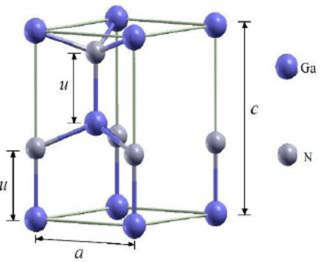

# Primitive relaxation

* First step in setting up the supercell is volume relaxing the primitive unit cell.
* Based on parameters from Andy from working with GaN before, I used a 5x5x3 k-point mesh to relax.
* Ran PBE on 128 processors on Perlmutter and finished in 30 seconds.
* Started with `AEXX=0.31` because that is what Guanzhi and Alkauskas et al. used. After relaxation, the band gap (calculated at $\Gamma$) is 3.78 eV
* Alkauskas et al. [cite the T=0 band gap of GaN](https://pubs.aip.org/aip/apl/article-abstract/87/24/242104/905759/Temperature-and-compositional-dependence-of-the?redirectedFrom=fulltext) as 3.5 eV.
* Using `AEXX=0.29` gave a band gap of 3.65 eV
* Realized that the energy cutoff used at 400 eV is the default from the POTCARs and does not seem high enough.
* I am now planning to converge the lattice parameters in the PBE calculation with respect to energy cutoff, then switch to using HSE with the converged cutoff.

Lattice parameters are determined based on diagram below:

  

*Note: $u$ is measured as a fraction of $c$*

Here are the results for volume relaxing at the PBE level (with extra decimal places to show convergence):
| `ENCUT` | Total E (eV) | Band Gap (eV) | $a$ (A) | $c$ (A) | $u$ |
|------|------------|---------|---------|------------|------|
| 400 | -24.29584864 | 1.819593 | 3.20032 | 5.20969 | 0.37686 |
| 520 | -24.30076274 | 1.714369 | 3.21896 | 5.24045 | 0.37686 |
| 600 | -24.30368614 | 1.714394 | 3.21896 | 5.24045 | 0.37686 |
| 650 | -24.30747166 | 1.715079 | 3.21896 | 5.24045 | 0.37686 |

*Note: There was no change in the CONTCAR between 520-650 eV cutoff.*

Based on those numbers, I would consider the energy cutoff converged at 520 eV. Now going to use this higher cutoff to tune the band gap with HSE.

* Relaxed with `AEXX=0.30` and got a band gap of 3.59 eV
* With `AEXX=0.29`, the band gap is 3.52 eV and the total energy is -30.44656065 eV. The lattice parameters are $a = 3.17$ A, $c=5.17$ A, and $u=0.377$.
* The experimental values are $a = 3.19$ A, $c=5.20$ A, and $u=0.377$ (*Semiconductors: Basic Data, edited by O. Madelung, 2nd ed. (Springer, Berlin, 1996).*)
* I confirmed these parameters with Sok and Xiaoguang on 2023-12-27. Will use this cell as the starting point for creating the supercell and will stick with `AEXX=0.29`.

## Summary
 I had to go through some trial and error to get the right parameters, but the order to recreate this result is
 * Relax with `ENCUT=520` eV at the PBE level with a 5x5x3 k-point mesh
 * Copy `CONTCAR` to `POSCAR` and uncomment HSE with `AEXX=0.29` then relax again (this is all you need to get the geometry)
 * Copy `CONTCAR` to `POSCAR` and turn off relaxation to do just SCF to update based on final positions (just to get updated energies if you want that)