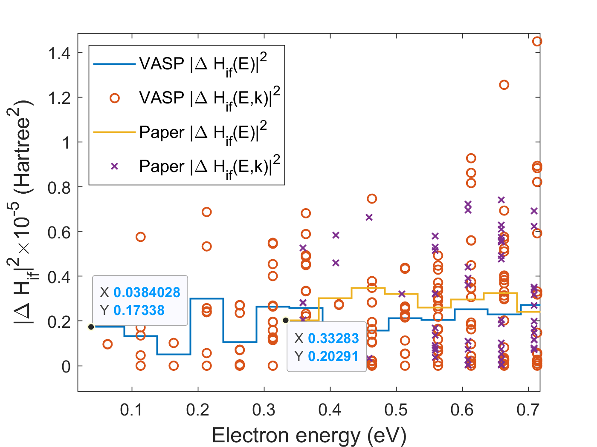

# Check effect of changes

The Barmparis paper made certain choices for the Si calculation that were not all correct. The new TME and Export codes need to be tested, so I will explore the effect of the changes that we made to his calculations and use those runs to test the Export and TME codes.

Georgios did a non-spin-polarized calculation in a 216-atom (3x3x3) supercell with a 3x3x3 k-point mesh and used the final-charge-state positions. We are doing a spin-polarized calculation in a 4x4x4 supercell at the Gamma point, using the initial-charge-state positions. Want to look at the effect of all of these changes. Leave the pristine cell alone and work only with the defect cell.

### Spin

Output from parallelized Export and TME with proper spin implemented match the output from the original version of TME ([see this old commit](https://github.com/laurarnichols/defectCrossSections/commit/ee49d32285488d5cc4d7b66b0cddcfd80f0586a4)). Adding spin did not change the results much, except the minimum `DE` went from 0.33 eV to 0.04 eV. I'm not exactly sure what the cause of this is, but I don't think we are using the final matrix elements from TME anymore and instead are just using the overlaps.

  

