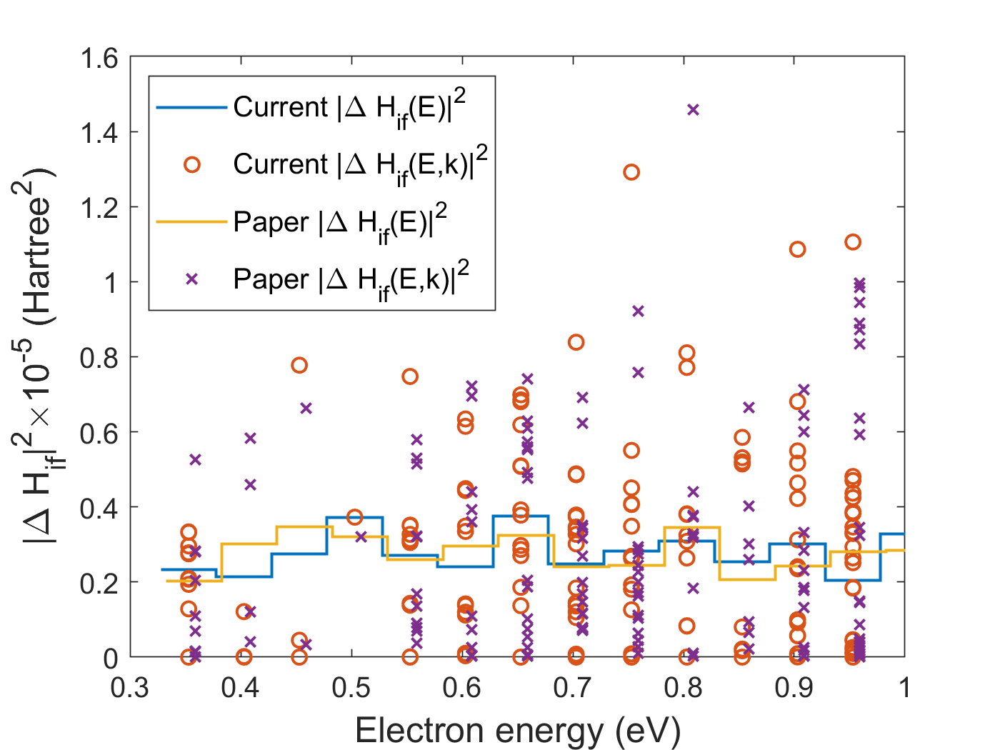

# Recreate Paper Matrix Elements in VASP

The goal of this set of calculations is to calculate the matrix elements doing exactly what the Barmparis paper did but use VASP instead of QE.

For the zeroth-order matrix element, we only need the initial state (neutral pristine) and the final state (ground-state defect). We consider electron capture by a triply-hydrogenated Si vacancy in bulk Si. In the initial (excited) state, the defect is positively charged, while it is neutral in the final (ground) state.

In the original paper, the geometry of each system (pristine, neutral defect, charged defect) were optimized independently. However, we should really be considering a vertical transition, so the final defect wave function should be taken from the system with the initial atomic positions (from positively-charged defect) and final (neutral) charge state. Because I am trying to validate our code and recreate the paper numbers, I am going to do what the paper did here. However, I am also going to do a calculation to see what difference is made by using the correct wave functions. 

## Tasks

I will need to do calculations on the perfect-crystal supercell and the final state of the defect with an electron captured. For each system, I will do a relaxation, an SCF calculation to converge the charge density based on the final ion positions (with more bands and tighter convergence), and an NSCF calculation to increase the k-point grid (with `ISYM = 0`). I will then need to export each and run the TME program to get the matrix elements.

- [ ] Neutral pristine
  - [x] Relax (including cell)
  - [x] SCF
  - [ ] NSCF
  - [ ] Export
- [ ] Negatively-charged defect with neutral supercell (final, ground state)
  - [ ] Relax (only inner dof)
  - [ ] SCF
  - [ ] NSCF
  - [ ] Export
- [ ] Run TME
- [ ] Plot results

## Results

Using the `Export` program from VASP as-is:

  

The results do not match. First, there is a slight offset. I think this is likely just due to a slight difference in the energy bands as calculated by VASP and QE, possibly related to the different pseudopotentials. However, this difference is small, so I don't think it is a concern. The matrix elements, though, are roughly twice as big as with the QE code. I am concerned that this could be more than just a numerical difference and could possibly be a bug in the `Export` code. 

I have noticed in the past that the G-vectors are sorted in the `ExportFromVASPOutput` code based on the magnitude of the vector, but they are not sorted in the `ExportFromVASPSrc` code. The different orderings in the different codes could be a potential source of this discrepancy. I am going to work on migrating the `projectors.ik` to `ExportFromVASPOutput` not only to speed up the export, but also to maintain a consistent G-vector ordering. I will rerun `TME` after the migration and see if that fixes the issue.
