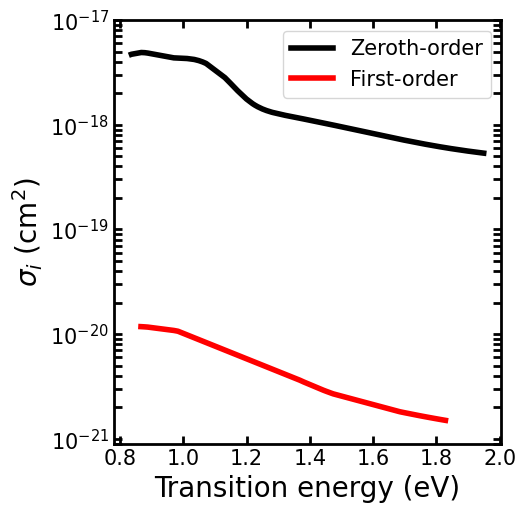

# Triply hydrogenated Si vacancy calculation for Time-Domain Paper

This calculation considers the +/0 transition for a triply hydrogenated vacancy in Si. The same transition was considered in the Barmparis paper, but the geometry used for the defect supercell was not correct, the charge state was set using jellium, spin polarization was not used, everything was done at the PBE level, and only eigenvalue differences were used. 

For this calculation, I will need the ground-state, perfect-crystal system; the excited-state, positive-defect system; and the ground-state, neutral-defect system. 

_Note: Andy mentioned in the past that with WZP, we need to confirm that the states we are placing the carriers in are not resonance states. He said to do this by generating `PARCHG` files. I don't remember how to do this off of the top of my head, but it's theoretically something that should be done for these calculations if we have time._

## Tasks
- [X] VASP and Export for [pristine](./Si/) and [defect](./SiVH3/VASPandExport/)
- [X] [Group velocity](./Si/VASPAndExport/groupVelocity/)
- [X] [Energy tabulator](./SiVH3/posToNeut/EnergyTabulator/)
- [X] [Phonons](./SiVH3/Phonons/)
- [X] [Phonon post-processing](./SiVH3/posToNeut/PhononPP)
- [X] Zeroth-order
  - [X] [Matrix elements](./SiVH3/posToNeut/zerothOrder/TME)
  - [X] [Transition rate](./SiVH3/posToNeut/zerothOrder/LSF)
- [X] First-order
  - [X] [Matrix elements](./SiVH3/posToNeut/firstOrder/TME)
  - [X] [Transition rate](./SiVH3/posToNeut/firstOrder/LSF)
- [X] [Post-processing and plotting](./SiVH3/results)

## Results

The plots and the notebooks used to generate them are in the [results](./SiVH3/results) folder. Here are the final results with a 4x4x4 supercell and a 3x3x3 grid for the zeroth-order term and $\Gamma$-only for the first-order term. 

  

